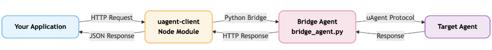
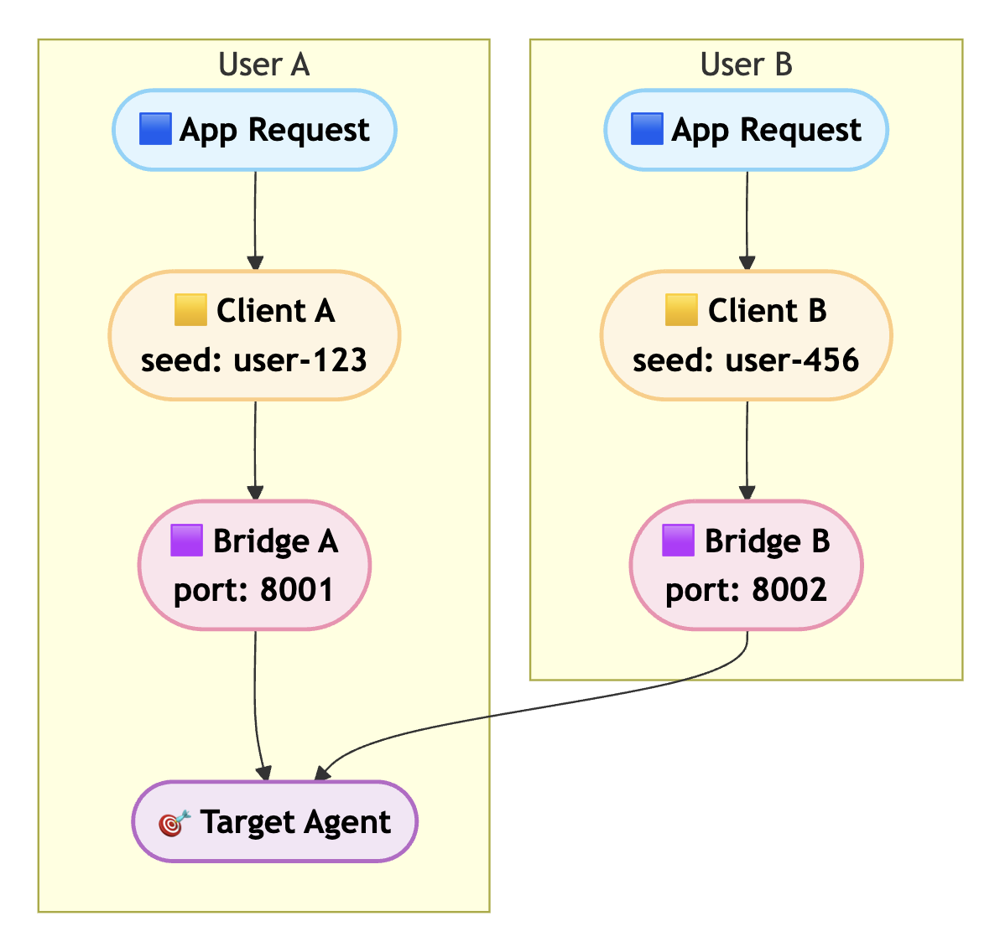
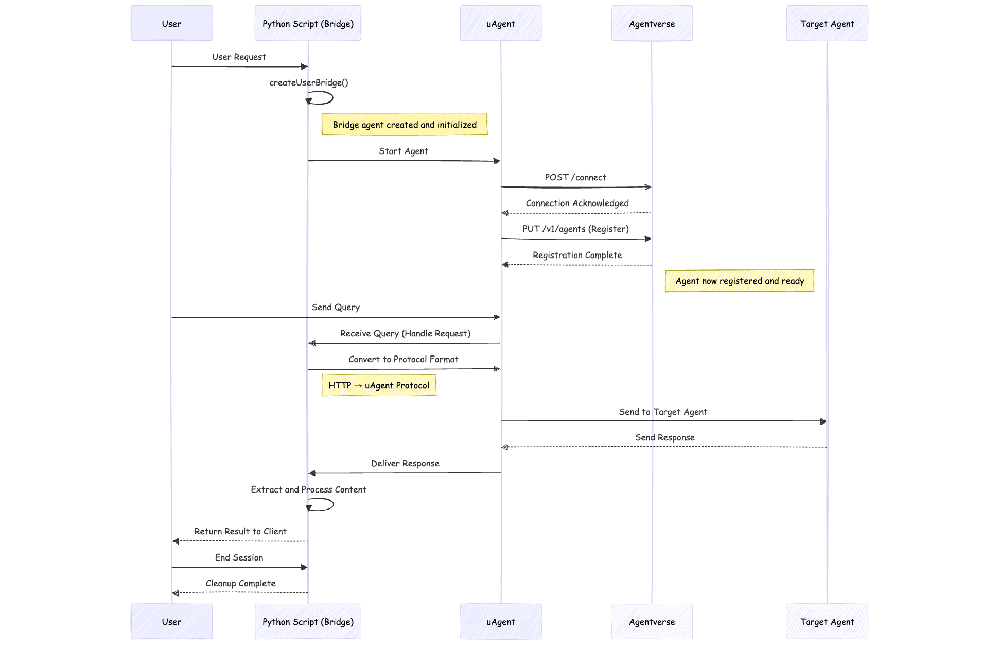

<div align="center">

# 🤖 uAgent Client

**Talk to any Fetch.ai uAgent from your Node.js or web application**

[](https://www.npmjs.com/package/uagent-client)
[](https://opensource.org/licenses/MIT)
[](https://www.typescriptlang.org/)
[](https://developer.mozilla.org/en-US/docs/Web/JavaScript)

*A simple, fast, and production-ready client for interacting with Fetch.ai uAgents*

[Quick Start](#-quick-start) • [Documentation](#-api-reference) • [Deployment](#-deployment) • [Examples](#-examples)

</div>

---

## 📝 About

**uAgent Client** is a powerful Node.js library that enables seamless communication with Fetch.ai uAgents directly from your JavaScript or TypeScript applications. Whether you're building a Next.js web app, a Node.js backend, or a standalone script, this client handles all the complexity of blockchain agent communication.

### 🌟 Key Highlights

✅ **Works with JavaScript & TypeScript** - Full support for both languages  
✅ **Zero Configuration** - Start using in minutes  
✅ **Automatic Bridge Setup** - Handles Python bridge agent automatically  
✅ **Per-User Isolation** - Separate bridge for each user session  
✅ **Agentverse Integration** - Automatic registration and discovery  
✅ **Production Ready** - Battle-tested in real applications  
✅ **Type Safe** - Complete TypeScript definitions included  
✅ **Docker Ready** - Container-based deployment support  
⚠️ **Platform Note** - Use Docker-compatible platforms (Render, AWS, GCP). Not compatible with Vercel/Netlify  

## ✨ Features

- 🚀 **Easy Integration** - Works with any Node.js or web app  
- 📘 **TypeScript Ready** - Full type support out of the box  
- 🌉 **Auto Bridge** - Automatically handles the bridge agent for you  
- 👥 **Per-User Bridges** - Isolated bridge agents for each user  
- 🌐 **Agentverse Integration** - Automatic registration with Agentverse  
- 🎯 **Simple API** - Just query and get responses  
- ✅ **Production Ready** - Used in real applications
- 🔒 **Secure** - Token management and authentication built-in

## ⚡ Quick Start

### 1️⃣ Install

```bash
npm install uagent-client
```

### 2️⃣ Use it (JavaScript)

```javascript
const UAgentClient = require('uagent-client');

// Create client
const client = new UAgentClient();

// Ask a question
const result = await client.query(
    'agent1q2g97humd4d6mgmcg783s2dsncu8hn37r3sgglu6eqa6es07wk3xqlmmy4v',
    'Search for pizza restaurants in New York'
);

if (result.success) {
    console.log(result.response);
} else {
    console.error(result.error);
}
```

### 2️⃣ Use it (TypeScript)

```typescript
import UAgentClient from 'uagent-client';

// Create client
const client = new UAgentClient();

// Ask a question with type safety
const result = await client.query(
    'agent1q2g97humd4d6mgmcg783s2dsncu8hn37r3sgglu6eqa6es07wk3xqlmmy4v',
    'Search for pizza restaurants in New York'
);

if (result.success) {
    console.log(result.response);
} else {
    console.error(result.error);
}
```

That's it! Works the same in both JavaScript and TypeScript! 🎉

## 📖 How to Use

> **💡 Note**: All examples below work identically in both JavaScript and TypeScript!

### JavaScript Examples

```javascript
const UAgentClient = require('uagent-client');

async function main() {
    const client = new UAgentClient();
    
    const result = await client.query(
        'agent_address_here',
        'Your question here'
    );
    
    if (result.success) {
        console.log('Agent says:', result.response);
    } else {
        console.log('Error:', result.error);
    }
}

main();
```

### TypeScript Examples

```typescript
import UAgentClient from 'uagent-client';

async function main() {
    const client = new UAgentClient();
    
    const result = await client.query(
        'agent_address_here',
        'Your question here'
    );
    
    if (result.success) {
        console.log('Agent says:', result.response);
    } else {
        console.log('Error:', result.error);
    }
}

main();
```

### Simple Method (Returns String)

```javascript
// JavaScript
const UAgentClient = require('uagent-client');
const client = new UAgentClient();

try {
    const response = await client.ask('agent_address', 'Your question');
    console.log(response); // Just the response string
} catch (error) {
    console.error('Failed:', error.message);
}
```

```typescript
// TypeScript
import UAgentClient from 'uagent-client';
const client = new UAgentClient();

try {
    const response: string = await client.ask('agent_address', 'Your question');
    console.log(response); // Just the response string
} catch (error) {
    console.error('Failed:', error instanceof Error ? error.message : 'Unknown error');
}
```

### Per-User Bridges (New!)

Create isolated bridge agents for each user with Agentverse registration:

```javascript
// JavaScript
const UAgentClient = require('uagent-client');

// With per-user bridge
const client = new UAgentClient({
    userSeed: 'user-123',
    agentverseToken: 'your-bearer-token'
});

// Or create programmatically
await client.createUserBridge('user-123', 'bearer-token');
```

```typescript
// TypeScript
import UAgentClient from 'uagent-client';

// With per-user bridge
const client = new UAgentClient({
    userSeed: 'user-123',
    agentverseToken: 'your-bearer-token'
});

// Or create programmatically
await client.createUserBridge('user-123', 'bearer-token');
```

Each user gets their own isolated bridge agent, automatically registered on Agentverse.

## 🏗️ Architecture

### System Workflow


### Per-User Isolation

Each user can have their own isolated bridge agent, providing separation and security:



### Complete Workflow Diagram

The complete lifecycle of a uAgent client session, showing the interaction between User, Python Script (Bridge), uAgent, Agentverse, and Target Agent:




This diagram shows the complete lifecycle of a uAgent client session, from initialization through query handling to cleanup.

## 🚀 Deployment

### ⚠️ Platform Compatibility

**Not Supported:**
- ❌ **Vercel** - Serverless platform, requires persistent Python processes
- ❌ **Netlify** - Serverless platform, requires backend services
- ❌ **Other Serverless Platforms** - This client needs persistent Python bridge processes

**Recommended for Production:**
- ✅ **Docker** - Container-based deployment
- ✅ **Render** - Full platform with Docker support
- ✅ **AWS ECS/EC2** - Container and VM support
- ✅ **Google Cloud Run/GKE** - Container platforms
- ✅ **DigitalOcean** - App Platform or Droplets
- ✅ **Railway** - Supports persistent processes
- ✅ **Any VM with Docker** - Full control

### 🐳 Docker Deployment

This client requires a persistent Python bridge agent, making it perfect for containerized deployments.

#### Dockerfile Example

```dockerfile
# Base image with Python and Node support
FROM node:18-slim

# Set working directory
WORKDIR /app

# Install system dependencies and create python symlink
RUN apt-get update && apt-get install -y \
    python3 python3-pip gcc g++ \
    && ln -s /usr/bin/python3 /usr/bin/python \
    && rm -rf /var/lib/apt/lists/*

# Copy package files first
COPY package*.json ./

# Install Node.js dependencies
RUN npm install

# Copy all project files
COPY . .

# Install Python dependencies from uagent-client
RUN pip3 install --no-cache-dir --break-system-packages --default-timeout=100 --retries 5 uagents uagents-core requests

# Expose Next.js port
EXPOSE 3000

# Start both the bridge agent and Next.js application
CMD ["sh", "-c", "if [ -f node_modules/uagent-client/bridge_agent.py ]; then python3 node_modules/uagent-client/bridge_agent.py & fi && npm run dev"]
```

#### Docker Compose Example

```yaml
services:
  app:
    build:
      context: .
      dockerfile: Dockerfile
    ports:
      - "3000:3000"
    volumes:
      - .:/app
      - /app/node_modules
      - /app/.next
    environment:
      - NODE_ENV=production
      - USER_SEED=your-seed
      - AGENTVERSE_TOKEN=your-bearer-token
```

#### Quick Start with Docker

```bash
# Build and run
docker-compose up -d

# View logs
docker-compose logs -f

# Stop
docker-compose down
```

### 🌐 Deployment Options

#### Render

1. Create new **Web Service** on Render
2. Connect your GitHub repository
3. Set build command: `npm install`
4. Set start command: `npm start`
5. Add environment variables:
   - `USER_SEED`
   - `AGENTVERSE_TOKEN`
6. Deploy!

Render provides persistent containers perfect for this client.

#### AWS (EC2/ECS)

**EC2 (Simple Deployment)**
```bash
# SSH into your EC2 instance
ssh -i your-key.pem ubuntu@your-ec2-ip

# Install Docker
sudo apt-get update
sudo apt-get install docker.io docker-compose

# Clone and run
git clone your-repo
cd your-repo
docker-compose up -d
```

**ECS with Docker**
- Create ECS task definition
- Use the Dockerfile above
- Deploy to ECS service with persistent connection
- Set environment variables in task definition

#### Google Cloud Run

```bash
# Build and push image
gcloud builds submit --tag gcr.io/PROJECT_ID/uagent-app

# Deploy
gcloud run deploy uagent-app \
  --image gcr.io/PROJECT_ID/uagent-app \
  --platform managed \
  --allow-unauthenticated \
  --set-env-vars "USER_SEED=your-seed,AGENTVERSE_TOKEN=your-token"
```

#### DigitalOcean

1. Create Droplet with Docker
2. Or use App Platform with Docker buildpack
3. Add environment variables in settings
4. Deploy with `docker-compose`

### 🔧 Environment Variables

Make sure to set these in your production environment:

```bash
USER_SEED=your-unique-seed
AGENTVERSE_TOKEN=your-bearer-token-from-agentverse.ai
UAGENT_ADDRESS=your-target-agent-address
```

> **Note**: Never commit these variables to your repository. Use your platform's environment variable management.

## 🌐 Production Example (Next.js)

### Backend API (`app/api/chat/route.ts`)

```typescript
import { NextRequest, NextResponse } from 'next/server';

const UAGENT_ADDRESS = 'agent1qfaar64uhcx6ct3ufyerl7csaytwsezwxekeukrwp3667fg8nl05c9fmze7';
const AGENTVERSE_TOKEN = 'your-bearer-token-here';
const USER_SEED = 'gautam';

const clientInstances = new Map<string, any>();

async function getClient(seed: string, token: string) {
  if (!clientInstances.has(seed)) {
    const UAgentClientModule = await import('uagent-client');
    const UAgentClient = UAgentClientModule.default || UAgentClientModule;
    
    const config: any = {
      timeout: 60000,
      autoStartBridge: true,
      userSeed: seed,
      agentverseToken: token
    };
    
    const client = new (UAgentClient as any)(config);
    await client.createUserBridge(seed, token);
    
    clientInstances.set(seed, client);
    await new Promise(resolve => setTimeout(resolve, 3000));
  }
  
  return clientInstances.get(seed);
}

export async function POST(request: NextRequest) {
  try {
    const { message, userSeed, agentverseToken } = await request.json();

    if (!message || typeof message !== 'string') {
      return NextResponse.json({ error: 'Invalid message' }, { status: 400 });
    }
    
    const client = await getClient(
      userSeed || USER_SEED,
      agentverseToken || AGENTVERSE_TOKEN
    );
    
    const result = await client.query(UAGENT_ADDRESS, message);

    if (result.success) {
      return NextResponse.json({ 
        response: result.response,
        success: true 
      });
    } else {
      return NextResponse.json({ 
        response: 'I apologize, but I was unable to process your request at this time.',
        success: false,
        error: result.error 
      });
    }
  } catch (error) {
    return NextResponse.json(
      { 
        response: 'An error occurred while processing your request.',
        error: error instanceof Error ? error.message : 'Unknown error' 
      },
      { status: 500 }
    );
  }
}
```

### 2. Frontend Component (`app/page.tsx`)

```typescript
'use client';

import { useState } from 'react';

export default function Chat() {
    const [messages, setMessages] = useState([]);
    const [input, setInput] = useState('');
    const [loading, setLoading] = useState(false);

    const handleSubmit = async (e) => {
        e.preventDefault();
        if (!input.trim() || loading) return;

        const userMessage = input.trim();
        setInput('');
        setMessages(prev => [...prev, { role: 'user', content: userMessage }]);
        setLoading(true);

        try {
            const res = await fetch('/api/chat', {
                method: 'POST',
                headers: { 'Content-Type': 'application/json' },
                body: JSON.stringify({ message: userMessage })
            });
            
            const data = await res.json();
            
            setMessages(prev => [...prev, { 
                role: 'agent', 
                content: data.success ? data.response : 'Error: ' + data.error
            }]);
        } catch (error) {
            setMessages(prev => [...prev, { 
                role: 'agent', 
                content: 'Failed to get response' 
            }]);
        } finally {
            setLoading(false);
        }
    };

    return (
        <div className="flex flex-col h-screen max-w-4xl mx-auto p-4">
            <h1 className="text-2xl font-bold mb-4">Chat with uAgent</h1>
            
            <div className="flex-1 overflow-y-auto space-y-4 mb-4">
                {messages.map((msg, i) => (
                    <div key={i} className={`p-4 rounded-lg ${
                        msg.role === 'user' ? 'bg-blue-100 ml-auto' : 'bg-gray-100'
                    }`}>
                        <p className="font-semibold mb-1">{msg.role === 'user' ? 'You' : 'Agent'}</p>
                        <p>{msg.content}</p>
                    </div>
                ))}
                {loading && <div className="text-gray-500">Agent is thinking...</div>}
            </div>

            <form onSubmit={handleSubmit} className="flex gap-2">
                <input
                    type="text"
                    value={input}
                    onChange={(e) => setInput(e.target.value)}
                    placeholder="Type your message..."
                    className="flex-1 p-3 border rounded-lg"
                    disabled={loading}
                />
                <button type="submit" disabled={loading || !input.trim()}
                    className="px-6 py-3 bg-blue-500 text-white rounded-lg hover:bg-blue-600 disabled:opacity-50">
                    Send
                </button>
            </form>
        </div>
    );
}
```

### 3. Run

```bash
npm run dev
```

## 📚 API Reference

### Constructor

```typescript
new UAgentClient({
    timeout?: number,           // Default: 35000ms
    bridgeUrl?: string,          // Default: 'http://localhost:8000'
    autoStartBridge?: boolean,   // Default: true
    userSeed?: string,           // For per-user bridges
    agentverseToken?: string     // For Agentverse registration
})
```

### Methods

#### `createUserBridge(seed, token, port?)`

Create a per-user bridge agent with Agentverse registration.

```typescript
const bridgeInfo = await client.createUserBridge(
    'user-123',           // Unique seed for user
    'bearer-token',       // Agentverse bearer token
    8001                  // Optional port
);
// Returns: { name, address, port, seed }
```

#### `query(agentAddress, query, requestId?)`

Send a query to an agent.

**Returns:**
```typescript
{
    success: boolean,
    response?: string,   // Response if success
    error?: string,      // Error if failed
    requestId: string
}
```

#### `ask(agentAddress, query)`

Send a query and get only the response string. Throws error if fails.

**Returns:** `Promise<string>`

#### `ping()`

Check if client is ready.

**Returns:** `Promise<boolean>`

#### `stopBridge()`

Stop the client and cleanup.

## ⚙️ Configuration

### Simple Configuration (Recommended)

Define your configuration as constants at the top of your API route:

```typescript
const UAGENT_ADDRESS = 'agent1q2...';
const AGENTVERSE_TOKEN = 'bearer_token...';
const USER_SEED = 'user-123';
```

This keeps configuration centralized and easy to manage.

### Environment Variables

You can also use environment variables:

```bash
# .env.local
UAGENT_ADDRESS=agent1q2...
AGENTVERSE_TOKEN=bearer_token...
USER_SEED=user-123
```

```typescript
const UAGENT_ADDRESS = process.env.UAGENT_ADDRESS;
const AGENTVERSE_TOKEN = process.env.AGENTVERSE_TOKEN;
const USER_SEED = process.env.USER_SEED;
```

## 💡 Common Use Cases

### Query Multiple Agents

```javascript
const client = new UAgentClient();

const results = await Promise.all([
    client.query(agent1, 'Question 1'),
    client.query(agent2, 'Question 2'),
    client.query(agent3, 'Question 3')
]);

results.forEach((result, i) => {
    if (result.success) {
        console.log(`Agent ${i + 1}:`, result.response);
    }
});
```

### Add Retry Logic

```javascript
async function queryWithRetry(client, address, query, maxRetries = 3) {
    for (let i = 0; i < maxRetries; i++) {
        const result = await client.query(address, query);
        if (result.success) return result;
        await new Promise(resolve => setTimeout(resolve, 1000));
    }
    throw new Error('Max retries exceeded');
}
```

## 🔒 Security

### ⚠️ Never Expose Your Token!

**Never expose your Agentverse token in the frontend!**

```javascript
// ❌ DON'T DO THIS
// Exposing token in client code
const token = 'bearer-token';

// ✅ DO THIS INSTEAD
// Keep token in backend API route
// app/api/chat/route.ts
const AGENTVERSE_TOKEN = 'bearer-token'; // Only server-side
```

### Best Practices

1. ✅ Define configuration as constants at the top
2. ✅ Keep tokens server-side only
3. ✅ Reuse client instances across requests
4. ✅ Handle errors gracefully
5. ✅ Set appropriate timeouts
6. ❌ Don't create new client for each request
7. ❌ Don't expose tokens in frontend

> **⚠️ IMPORTANT**: Never commit `.env` files to git. Always use environment variables in production.

## 🛠️ Troubleshooting

### "Failed to start"

**Solution:** Install Python and uagents:

```bash
python3 --version  # Should be 3.8+
pip install uagents uagents-core
```

### "No response"

**Possible causes:**
- Agent is offline
- Wrong agent address
- Network issues
- Timeout too short

**Solution:** Increase timeout:

```javascript
const client = new UAgentClient({ timeout: 120000 });
```

### Bridge Creation Fails

**Solution:** Check your Python environment and token:

```bash
# Verify Python is installed
python --version

# Verify token is valid
# Get token from https://agentverse.ai
```

## 📘 TypeScript Support

Full TypeScript types included:

```typescript
import UAgentClient, { 
    QueryResponse,
    BridgeInfo 
} from 'uagent-client';

const client = new UAgentClient();

const result: QueryResponse = await client.query(
    agentAddress,
    query
);

const bridgeInfo: BridgeInfo = await client.createUserBridge(
    seed,
    token
);
```

## 🎯 Examples

### Simple Chat Bot

```javascript
const UAgentClient = require('uagent-client');

const client = new UAgentClient();

async function chat(message) {
    const result = await client.query(
        'agent1q2g97humd4d6mgmcg783s2dsncu8hn37r3sgglu6eqa6es07wk3xqlmmy4v',
        message
    );
    
    return result.success ? result.response : 'Sorry, I could not respond.';
}

// Use it
const response = await chat('Hello!');
console.log(response);
```

### Per-User Isolated Chat

```javascript
const UAgentClient = require('uagent-client');

async function chatPerUser(userId, message) {
    const client = new UAgentClient({
        userSeed: userId,
        agentverseToken: 'your-token'
    });
    
    await client.createUserBridge(userId, 'your-token');
    
    const result = await client.query(
        'agent-address',
        message
    );
    
    return result.success ? result.response : 'Error';
}

// Each user gets their own bridge
const user1Response = await chatPerUser('user-123', 'Hello');
const user2Response = await chatPerUser('user-456', 'Hello');
```

## 🔗 Additional Resources

For the complete code and additional examples, visit the [uAgent Client Repository](https://github.com/fetchai/innovation-lab-examples/tree/main/frontend-integration/frontend-integration).- Full Next.js chat app with:
- Modern UI (like ChatGPT)
- Dark mode support
- TypeScript
- Production-ready code

## 🤝 Contributing

We welcome contributions! Please see our contributing guidelines:

- 📖 [Contributing Guide](CONTRIBUTING.md) - How to contribute
- 📋 [Code of Conduct](CODE_OF_CONDUCT.md) - Community standards
- 🔒 [Security Policy](SECURITY.md) - Reporting vulnerabilities
- 📝 [Changelog](CHANGELOG.md) - Version history

### Quick Start for Contributors

1. Fork the repository
2. Create your feature branch (`git checkout -b feature/amazing-feature`)
3. Commit your changes (`git commit -m 'feat: add amazing feature'`)
4. Push to the branch (`git push origin feature/amazing-feature`)
5. Open a Pull Request

For more details, see [CONTRIBUTING.md](CONTRIBUTING.md).

## 📦 Links

- [📦 NPM Package](https://www.npmjs.com/package/uagent-client)
- [💻 GitHub Repository](https://github.com/gautammanak1/uagent-client)
- [🐛 Report Bug](https://github.com/gautammanak1/uagent-client/issues/new?template=bug_report.md)
- [💡 Request Feature](https://github.com/gautammanak1/uagent-client/issues/new?template=feature_request.md)
- [🌐 Fetch.ai](https://fetch.ai)
- [🤖 uAgents Framework](https://github.com/fetchai/uAgents)

## 📄 License

This project is licensed under the MIT License - see the [LICENSE](LICENSE) file for details.

---

<div align="center">

**Made with ❤️ for the Fetch.ai ecosystem**

**License**: [MIT](LICENSE) • **Author**: [@gautammanak1](https://github.com/gautammanak1)

[](https://github.com/gautammanak1/uagent-client/graphs/contributors)
[](https://github.com/gautammanak1/uagent-client/issues)
[](https://github.com/gautammanak1/uagent-client/stargazers)

</div>
